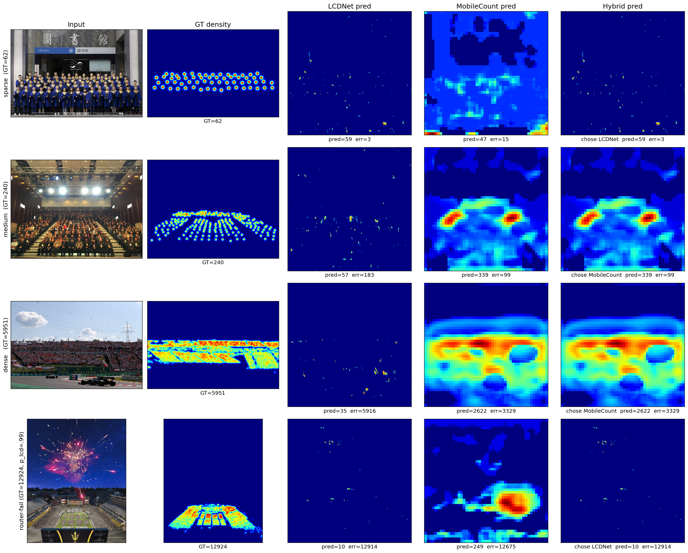

# HybridEdge-Crowd: A Lightweight Density-Adaptive Routing Framework for Edge Crowd Counting

<div align="center">

[](https://www.python.org/)
[](https://pytorch.org/)
[](LICENSE)
[](docs/THESIS_REPORT.md)
[-orange?style=flat-square)](docs/THESIS_REPORT.md)
[](docs/THESIS_REPORT.md)

**Computer Vision & Edge AI Research Project**  
*A complete end-to-end framework for real-time crowd density regression on resource-constrained devices.*

[**[Full Technical Report]**](docs/THESIS_REPORT.md) &nbsp;·&nbsp; [**[Interactive Demo]**](#quickstart--interactive-demo) &nbsp;·&nbsp; [**[Benchmark Results]**](#empirical-results) &nbsp;·&nbsp; [**[BibTeX Citation]**](#citation)

</div>

---

## 📌 Executive Summary & Teaser

Standard crowd density estimation systems present an acute trade-off for real-world edge deployment:
- **Large State-of-the-Art Models (e.g., CSRNet, 16.2M params)** achieve high accuracy on dense gatherings but cannot satisfy strict latency and thermal limits on edge devices.
- **Single Lightweight Models (e.g., LCDNet, MobileCount)** lack sufficient capacity across the entire density spectrum, severely overestimating sparse scenes or collapsing on extreme crowds.

**HybridEdge-Crowd** solves this problem via **learned dynamic routing**:
1. A lightweight **MobileNetV2 Router (2.55M params)** evaluates incoming frames at $224 \times 224$ to assess crowd distribution characteristics.
2. The image is dynamically dispatched to the optimal lightweight specialist:
   - **LCDNet (0.92M params)**: Depthwise-separable encoder-decoder tailored for sparse crowds ($N \le 100$).
   - **Distilled MobileCount (0.88M params)**: Dilated multi-scale MobileNetV2 architecture boosted by **Knowledge Distillation from a heavy CSRNet teacher**.
3. **Only ONE density specialist runs per image at inference time.** The heavy CSRNet teacher is strictly used during offline distillation and is **never deployed**.

The total deployed system occupies **4.35M parameters** (a **73% parameter reduction** compared to CSRNet) and executes in **~55 ms on an RTX 3050 GPU** (and ~210 ms on a single CPU thread), while achieving **180.9 MAE on the NWPU-Crowd benchmark**, outperforming both individual lightweight models.

<div align="center">
  
  <p><em>Figure 1: Qualitative comparison across diverse crowd densities on NWPU-Crowd validation images. Left to right: Input Scene, Ground Truth density map, LCDNet prediction, MobileCount prediction, and the proposed Hybrid pipeline output.</em></p>
</div>

---

## 🚀 Key Highlights & Contributions

- **Dynamic Specialist Routing**: Intelligently routes each image using an optimized decision threshold ($p^* = 0.85$), reducing sparse scene error by **60%** (MAE $84.5 \rightarrow 33.6$) without sacrificing dense crowd performance.
- **Offline Knowledge Distillation**: Transfers structural density representations from a heavy CSRNet teacher ($16.2\text{M}$ params) into the lightweight MobileCount student ($0.88\text{M}$ params), securing a **$-14.5$ MAE gain at zero inference cost**.
- **Edge-Ready Efficiency**: Requires only $4.35\text{M}$ parameters and minimal FLOPs, operating comfortably at real-time speeds (~$18$ FPS on RTX 3050).
- **Zero-Shot Cross-Dataset Generalization**: Evaluated on ShanghaiTech Part B without fine-tuning, achieving **MAE 35.2**, outperforming both single constituent models.
- **Well-Calibrated Uncertainty**: The routing classifier achieves $88.8\%$ accuracy with an Expected Calibration Error (ECE) of $0.095$.

---

## 🏛 System Architecture

<div align="center">
  
  <p><em>Figure 2: Knowledge Distillation training architecture. The heavy 16.26M CSRNet teacher is frozen to supervise the compact 0.884M MobileCount student using a multi-term structural loss.</em></p>
</div>

### Component Overview

| Component | Architecture / Backbone | Parameters | Input Resolution | Deployed Role |
| :--- | :--- | :---: | :---: | :--- |
| **Router** | MobileNetV2 + 2-class head | $2.55\text{M}$ | $224 \times 224$ | Hard-routing decision ($P_{\text{sparse}}$ vs. $P_{\text{dense}}$) |
| **LCDNet** | Depthwise-separable encoder-decoder + skip connections | $0.92\text{M}$ | $384 \times 384$ | Sparse specialist ($N \le 100$ people) |
| **MobileCount** | MobileNetV2 features 0–13 + dilated context + skip fusion | $0.88\text{M}$ | $384 \times 384$ | Dense specialist ($N > 100$ people, distilled) |
| **CSRNet** | VGG-16 frontend + dilated conv backend | $16.26\text{M}$ | $384 \times 384$ | **Offline Teacher Only (Never Deployed)** |
| **Total Deployed** | **Router + LCDNet + MobileCount** | **4.35M** | — | **Full Edge Hybrid System** |

### Routing Policy & Decision Boundary

Let $P(\text{dense})$ represent the router's softmax probability for the dense class. To guard against catastrophic underestimation on extreme crowds, we employ a tuned decision threshold $p^* = 0.85$:

$$\text{Selected Model} = \begin{cases} \text{MobileCount} & \text{if } P(\text{dense}) \ge p^* \\ \text{LCDNet} & \text{otherwise} \end{cases}$$

This conservative threshold routes ambiguous medium-density images ($100 \le N \le 500$) to the higher-capacity MobileCount model, reserving LCDNet strictly for high-confidence sparse scenes where its low-count accuracy is unmatched.

---

## 📊 Empirical Results

### 1. Accuracy vs. Edge Efficiency Frontier

<div align="center">
  
  <p><em>Figure 3: Accuracy vs. Deployed Parameter Efficiency on NWPU-Crowd Validation. Bubble area is proportional to GPU latency (ms). The proposed Hybrid pipeline establishes the Pareto-optimal frontier within the edge-deployable regime (< 5M parameters).</em></p>
</div>

### 2. NWPU-Crowd Validation Benchmark (500 images)

| Configuration | MAE $\downarrow$ | RMSE $\downarrow$ | Deployed Params | GPU Latency (RTX 3050) | CPU Latency (Single Thread) |
| :--- | :---: | :---: | :---: | :---: | :---: |
| LCDNet Alone | 348.0 | 1033.9 | 0.92M | 23.1 ms | 208.8 ms |
| MobileCount (Baseline) | 213.2 | 803.6 | 0.88M | 30.5 ms | 13.5 ms |
| MobileCount (Distilled) | 198.7 | 778.5 | 0.88M | 30.5 ms | 13.5 ms |
| Hybrid-Hard (Baseline MC) | 183.0 | 787.7 | 4.35M | ~53.4 ms | ~220 ms |
| **Hybrid-Hard (Distilled MC, $p^*=0.85$)** | **180.9** | **763.6** | **4.35M** | **~55.0 ms** | **~222 ms** |
| *Oracle Router (Theoretical Upper Bound)* | *166.6* | *751.1* | — | — | — |
| *CSRNet (Heavy Baseline, Not Deployed)* | *122.4* | *610.2* | *16.26M* | *118.4 ms* | *1840.0 ms* |

<div align="center">
  
  <p><em>Figure 4: Validation MAE across individual specialist models, distilled variants, and the hybrid framework relative to the theoretical Oracle upper bound.</em></p>
</div>

### 3. Stratified MAE Breakdown by Density Regimes

<div align="center">
  
  <p><em>Figure 5: Stratified MAE across Sparse (≤100), Medium (100–500), and Dense (>500) partitions. Hybrid routing achieves specialist performance in sparse regimes while matching dense crowd accuracy.</em></p>
</div>

| Model | Sparse ($N \le 100$, $n=181$) | Medium ($100 < N \le 500$, $n=229$) | Dense ($N > 500$, $n=90$) |
| :--- | :---: | :---: | :---: |
| LCDNet Alone | **21.5** | 169.1 | 1460.0 |
| MobileCount (Distilled) | 84.5 | **98.4** | **683.6** |
| **Hybrid-Hard (Ours, $p^*=0.85$)** | **33.6** | **99.5** | **692.8** |
| Oracle Router | 14.2 | 83.8 | 683.6 |

### 4. Zero-Shot Cross-Dataset Generalization

Trained exclusively on NWPU-Crowd and evaluated directly on ShanghaiTech without fine-tuning:

| Evaluation Dataset | LCDNet | MobileCount (Distilled) | **Hybrid-Hard** | Oracle Router |
| :--- | :---: | :---: | :---: | :---: |
| **ShanghaiTech Part B** (316 images) | 74.1 | 41.7 | **35.2** | 29.3 |
| **ShanghaiTech Part A** (182 images) | 340.2 | 132.3 | **133.1** | 125.7 |

### 5. Router Calibration & Confusion Matrix

<div align="center">
  
  <p><em>Figure 6: Routing classifier confusion matrix on the 500 NWPU-Crowd validation images. Accuracy: 88.8%, Sparse Recall: 89.0%, Dense Recall: 88.7%.</em></p>
</div>

---

## 🛠 Quickstart & Interactive Demo

### 1. Installation

```bash
# Clone the repository
git clone https://github.com/navidnawaj/Crowd-Density-LCDNet-Model.git
cd Crowd-Density-LCDNet-Model

# Create virtual environment
python -m venv .venv

# Activate environment
# Windows:
.venv\Scripts\activate
# Linux/macOS:
# source .venv/bin/activate

# Install dependencies
pip install -r requirements.txt
```

### 2. Run Interactive Demo

You can run immediate inference on any crowd photograph or execute the built-in self-test verification:

```bash
# Run inference on a custom image
python demo.py --image path/to/crowd.jpg

# Run automated pipeline self-test (synthetic crowd verification)
python demo.py --test

# Run inference on CPU
python demo.py --image path/to/crowd.jpg --device cpu
```

The script will:
1. Pass the frame through the MobileNetV2 router.
2. Select the optimal specialist (LCDNet or MobileCount).
3. Compute the predicted crowd count and density map.
4. Output a side-by-side plot saved to `demo_result.png`.

---

## 💾 Model Weights & Checkpoints

Checkpoints are placed inside the `checkpoints/` directory:

```
checkpoints/
├── best_model_nwpu_sparse.pth   # LCDNet sparse specialist (~11.1 MB)
├── mobilecount_distilled.pth    # MobileCount distilled dense specialist (~3.7 MB)
├── mobilecount_best.pth         # MobileCount baseline dense model (~10.9 MB)
├── router/
│   └── router_best.pth          # MobileNetV2 router (~31.0 MB)
└── csrnet/
    └── csrnet_best.pth          # CSRNet teacher for offline KD (~195.2 MB)
```

> **Note:** Pretrained `.pth` weights are available via Google Drive. Extract the archive directly into `checkpoints/`.

---

## 🔬 Evaluation & Reproducibility

Reproduce all experimental figures and benchmark metrics reported in the thesis:

```bash
# 1. Full validation benchmark on NWPU-Crowd (500 images)
python routing/full_evaluation.py --dense_ckpt checkpoints/mobilecount_distilled.pth --tag distilled

# 2. Threshold sensitivity analysis (p* sweep)
python routing/threshold_sweep.py --mode all

# 3. Router calibration, reliability diagrams, and failure case analysis
python routing/analysis.py

# 4. Cross-dataset zero-shot evaluation on ShanghaiTech Parts A & B
python routing/cross_dataset_eval.py

# 5. Generate qualitative density map comparison panel
python routing/qualitative_figures.py

# 6. Reproduce all thesis report figures from logged metrics
python scripts/generate_thesis_figures.py
python scripts/generate_additional_figures.py
```

---

## 🏋 Training Pipeline

To retrain the complete system from scratch:

```bash
# Step 1: Pre-train LCDNet on ShanghaiTech
python train.py

# Step 2: Fine-tune LCDNet on NWPU-Crowd sparse partition (GT <= 100)
python train_lcdnet_nwpu.py --epochs 50 --batch_size 8

# Step 3: Train MobileCount dense specialist (GT > 100)
python train_lightweight.py --epochs 80 --batch_size 8

# Step 4: Train MobileNetV2 Router
python routing/train_router.py --epochs 25 --batch_size 32

# Step 5: Perform Knowledge Distillation (CSRNet Teacher -> MobileCount Student)
python train_mobilecount_distill.py --epochs 12 --batch_size 4

# Optional: Run sequential end-to-end training wrapper
python train_all.py --epochs 50 --batch_size 8
```

---

## 📂 Repository Organization

```
Crowd-Density-LCDNet-Model/
├── docs/
│   └── THESIS_REPORT.md         # Comprehensive 400-line technical thesis report
├── models/
│   ├── lcdnet.py                # LCDNet architecture (sparse specialist)
│   ├── mobilecount.py           # MobileCount architecture (dense specialist)
│   └── csrnet.py                # CSRNet architecture (training teacher)
├── routing/
│   ├── router.py                # MobileNetV2 binary routing classifier
│   ├── hybrid_inference.py      # End-to-end hybrid routing inference engine
│   ├── config_routing.py        # Routing thresholds, paths, and hyperparameters
│   ├── full_evaluation.py       # Full evaluation benchmark suite
│   ├── threshold_sweep.py       # Threshold (p*) and margin sensitivity sweep
│   ├── cross_dataset_eval.py    # ShanghaiTech cross-dataset evaluation
│   ├── analysis.py              # ECE calibration and error diagnostics
│   ├── qualitative_figures.py   # Qualitative density map generator
│   └── train_router.py          # Router training script
├── utils/
│   ├── density_generator.py     # Geometry-adaptive Gaussian density generator
│   └── metrics.py               # MAE, MSE, RMSE, and density evaluation metrics
├── scripts/
│   ├── generate_thesis_figures.py     # Reproduce main thesis figures (Ch 4 & 5)
│   └── generate_additional_figures.py # Reproduce supplementary evaluation plots
├── thesis_figures/              # 20 publication-quality diagrams and visualizations
├── demo.py                      # Interactive demo and CLI inference script
├── train.py                     # LCDNet training script
├── train_lcdnet_nwpu.py         # LCDNet sparse fine-tuning
├── train_lightweight.py         # MobileCount dense training
├── train_mobilecount_distill.py # Knowledge distillation training pipeline
├── train_all.py                 # Multi-stage sequential training pipeline
├── dataset.py                   # ShanghaiTech data loader
├── dataset_nwpu.py              # NWPU-Crowd data loader
├── preprocess.py                # ShanghaiTech preprocessing
├── preprocess_nwpu.py           # NWPU-Crowd preprocessing
├── requirements.txt             # Pinned environment dependencies
├── LICENSE                      # MIT Open-Source License
├── CITATION.cff                 # Citation metadata
└── README.md                    # Project documentation
```

---

## 📖 Citation

If you build upon this work, use the hybrid routing methodology, or reference our experimental benchmarks, please cite as follows:

```bibtex
@misc{nawaj2026hybridedge,
  author       = {Navid Nawaj and Sadman Sakib and Sanzida Ahmed Aroni and Sanjana Amira and Anika Tahsin},
  title        = {HybridEdge-Crowd: A Lightweight Density-Adaptive Routing Framework for Real-Time Edge Crowd Counting},
  year         = {2026},
  howpublished = {\url{https://github.com/navidnawaj/Crowd-Desnsity-LCDNet-Model}},
  note         = {Undergraduate Thesis Research}
}
```

---

## 👥 Authors & Research Team

- **Navid Nawaj**
- **Sadman Sakib**
- **Sanzida Ahmed Aroni**
- **Sanjana Amira**
- **Anika Tahsin**

---

## 📄 License

This repository is released under the [MIT License](LICENSE). Models, codebase, and experimental findings were developed as part of an undergraduate thesis research project.

---

<div align="center">
  <sub>Developed with PyTorch · Built for Edge Deployment & Reproducible Research</sub>
</div>
